# ecommerce-data-wrangling
A comprehensive e-commerce dataset analysis using Python and pandas, showcasing data cleaning, wrangling, and advanced analytical techniques

## E-commerce Data Analysis and Wrangling

#### Overview

In this project, I worked with a comprehensive dataset of 500 e-commerce transactions to demonstrate my proficiency in various data analysis techniques using Python and pandas. The analysis covered key aspects of the data pipeline, including exploration, cleaning, 
aggregation, wrangling, and advanced analysis, with optional visualizations.

#### Objectives
- To explore and summarize the dataset to identify patterns and insights.
- To clean and prepare the data for analysis by handling missing values, duplicates, and data inconsistencies.
- To filter and subset data based on specific criteria.
- To perform aggregations and groupings to extract meaningful insights.
- To wrangle data, including merging additional datasets and adjusting pricing based on conditions.
- To apply advanced analysis techniques for more complex data manipulation.
- To optionally visualize the results for clearer communication of insights.

#### Dataset
The e-commerce dataset is a made-up dataset generated by ChatGPT that includes 500 transactions with the following columns:
- **order_id**: Unique identifier for each order.
- **customer_id**: Unique identifier for customers.
- **product_id**, product_name, product_category: Product details.
- **price**, **quantity**: Pricing and quantity information.
- **order_date**, **delivery_date**: Timeline for order placement and delivery.
- **status**: Status of the order (e.g., Shipped, Returned, Pending).
- **payment_type**, country: Payment method and customer location.

An additional dataset was merged, containing customer demographics with columns:
- **customer_id**: Unique identifier.
- **age**: Customer age.
- **gender**: Customer gender.
- **city**: Customer location.

### Process and Techniques
### 1. Data Exploration and Summary Statistics
Explored the dataset to get an overview of its structure and the relationships between variables.
Generated summary statistics such as total orders, revenue, unique categories, and customer count.

**Reading in the dataset**
```python
sales = pd.read_csv(r"C:\Users\User\Downloads\ecommerce_sales.csv")
```

- **What are the first 5 rows of the dataset?**
```python
sales.head()
```

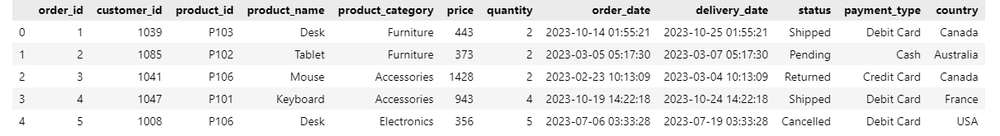

- **How many orders are there in the dataset?**
```python
total_orders = sales['order_id'].nunique()
print('total number of orders:',total_orders)
```


- **What are the unique product categories in the dataset?**
```python
unique_categories = sales['product_category'].unique()
print("Unique product categories:", unique_categories)
```

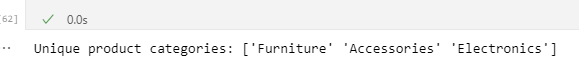

- **Calculate the total revenue (price * quantity) for all orders combined.**
```python
sales['revenue'] = sales['price'] * sales['quantity']
total_revenue = sales['revenue'].sum()
print("Total Revenue:",total_revenue)
```


- **How many orders are in the "Shipped" status?**
```python
orders_shipped = sales[sales['status'] == 'Shipped']['order_id'].nunique()

print('Number of Shipped orders:',orders_shipped)
```


- **How many unique customers placed orders?**
```python
unique_customers = sales['customer_id'].nunique()

print("Number of Unique Customers:", unique_customers)
```


### 2. Data Cleaning
Handled duplicate customer_id values by retaining only the most recent order for each customer.
Dealt with missing values where applicable.
Standardized formats for consistency across all columns.

- **Some entries in the product_name column have leading or trailing spaces. Clean up this column.**
```python
sales['product_name'] = sales['product_name'].str.strip()
```
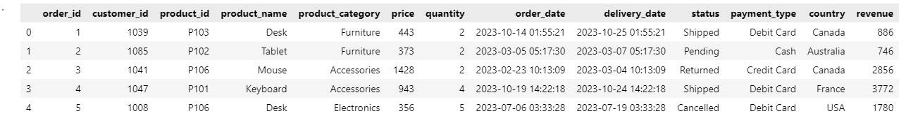

- **Check for missing values in the dataset. Which columns contain null or missing values? If any, how would you handle them?**
The data had no missing values but here is how I would have handled any missing values;

**Handling Missing Values:**

**Remove Rows/Columns:** - If the missing values are sparse or not significant, you can remove the rows or columns using dropna(). This is ideal when the data is not essential or the proportion of missing values is very small.

**Numerical Columns:** - Filling missing numerical data with the mean, median, or mode.

**Categorical Columns:** - For missing categorical data, can fill it with the most frequent value or create a new category like "Unknown".

**Forward/Backward Fill:** - If the data is time-series or sequential, would consider filling missing values based on previous or next valid entries using fillna(method='ffill') or fillna(method='bfill').

The method of handling missing values depends on the context and importance of the data in the analysis.

```python
#Checking for null values
sales.isnull().sum()
```
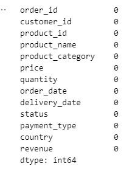

Convert the order_date and delivery_date columns to datetime format.
Create a new column called delivery_time_days that calculates the difference between delivery_date and order_date in days.


### 3. Filtering and Subsetting Data

- **Filter the dataset to show only orders where the payment was made using "PayPal".**
```python
paypal_orders = sales[sales['payment_type'] == 'PayPal']

paypal_orders
```

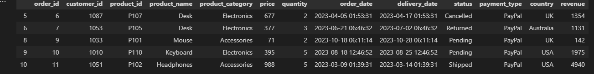

- **Extract all orders placed by customers in the UK.**
```python
UK_orders  = sales[sales['country'] == 'UK']
UK_orders
```
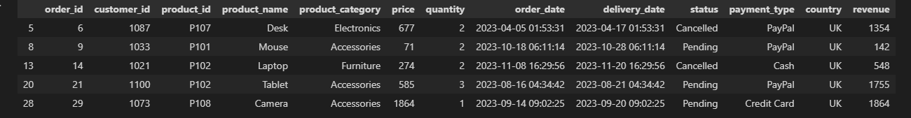

- **Find all orders that were shipped after 10 days (i.e., where the difference between delivery_date and order_date is more than 10 days).**
```python
shipped_after_10_days = sales[sales['delivery_time_days'] > 10]
shipped_after_10_days
```
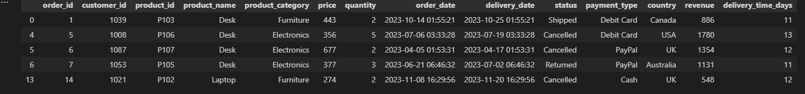

- **Select all orders that were either cancelled or returned.**
```python
cancelled_or_returned_orders = sales[sales['status'].isin(['Cancelled','Returned'])]
cancelled_or_returned_orders
```

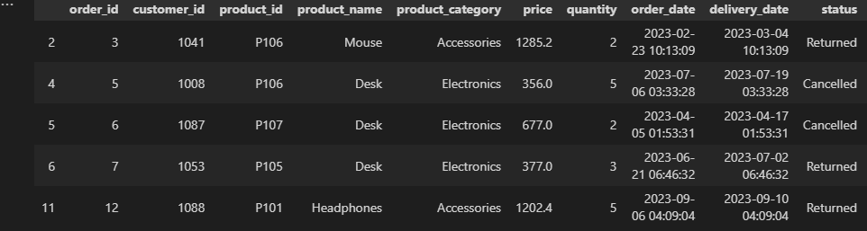

### 4. Aggregation and Grouping
- **Calculate the total revenue for each product category.**

```python
product_category_sales = sales.groupby('product_category')['revenue'].sum().reset_index()
product_category_sales
```
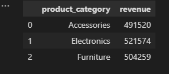

- **Find the average price per product category.**

```python
avg_price_per_category = sales.groupby('product_category')['price'].mean().reset_index()
avg_price_per_category
```
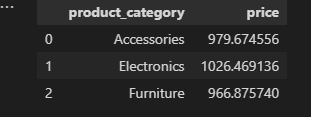

- **How many orders were placed from each country?**

```python
orders_by_country = sales.groupby('country')['order_id'].count().reset_index()
orders_by_country
```

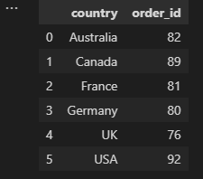

- **Group the data by payment_type and find the total quantity ordered for each payment type.**
```python
qty_by_payment_type = sales.groupby('payment_type')['quantity'].sum().reset_index()
qty_by_payment_type
```
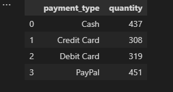


### 5. Data Wrangling
- **There are some duplicate customer_id values (customers who placed multiple orders). Drop any duplicates based on the customer_id and keep only the most recent order based on the order_date.**
```python
# Sort by 'Customer_Id' and 'order_date' in descending order to get the most recent orders first
sales_sorted = sales.sort_values(by=['customer_id', 'order_date'], ascending=[True, False])

# Drop duplicates, keeping only the first (most recent) order for each 'Customer_Id'
sales_most_recent = sales_sorted.drop_duplicates(subset='customer_id', keep='first')

# Optional: Reset index for a clean look
sales_most_recent.reset_index(drop=True, inplace=True)

# Check the result
sales_most_recent.head()
```

- **Suppose there’s a column called discount, which was missing in the dataset. Add a 10% discount to all products in the "Accessories" category and adjust their prices accordingly.**
```python
sales.loc[sales['product_category'] == 'Accessories', 'discount'] = 0.10  # Adding a 10% discount

# Adjusting prices for discounted items
sales.loc[sales['product_category'] == 'Accessories', 'price'] = sales['price'] * (1 - sales['discount'])

sales
```

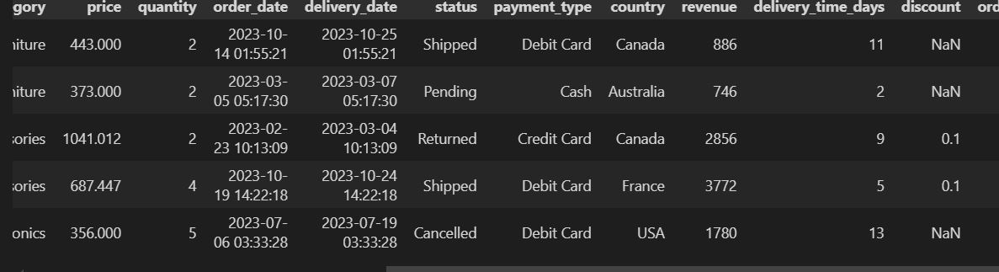


- **Merge another DataFrame that contains customer demographics (columns like customer_id, age, gender, city).**
```python
# reading the customer demographics data
customer_demographics = pd.read_csv(r"C:\Users\User\Downloads\customer_demographics.csv")

#merging the two datasets
new_sales_df = sales.merge(customer_demographics,on='customer_id',how='left')
new_sales_df.head()
```
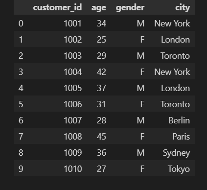

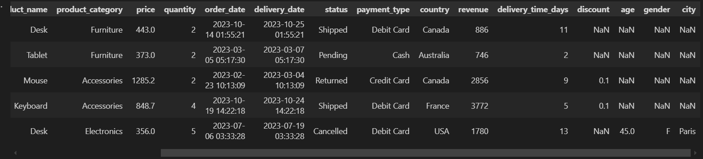

### 6. Advanced Analysis

- **Create a pivot table that shows the total revenue by country and payment_type.**
```python
pivot_table = sales.pivot_table(values='revenue', index='country', columns='payment_type', aggfunc='sum')

print(pivot_table)
```
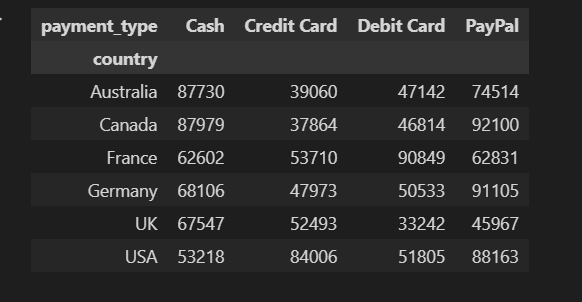

- **Identify the most popular product category by the total quantity sold.**
```python
most_popular_category  = sales.groupby('product_category')['quantity'].sum().reset_index().nlargest(1,'quantity')
most_popular_category
```


- **Create a new column that categorizes orders as “High Value” if the total order value (price * quantity) is greater than 500, otherwise categorize them as “Low Value”.**
```python
sales['order_value'] = sales['quantity']*sales['price']

sales['order_category'] = 'Low Value'

sales.loc[sales['order_value'] > 500,'order_category'] = 'High Value'
sales.head()
```
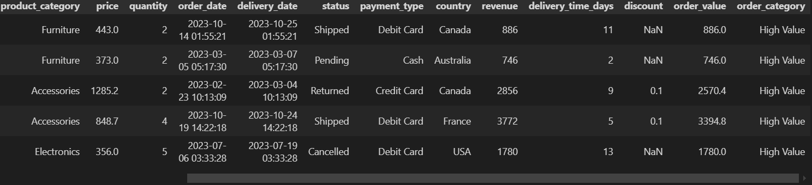


- **Find the customer who spent the most on orders and calculate the total amount spent by that customer.**
```python
# Group by 'customer_id' and calculate the total amount spent per customer
customer_spending = sales.groupby('customer_id')['revenue'].sum().reset_index()

# Find the customer who spent the most
top_customer = customer_spending.loc[customer_spending['revenue'].idxmax()]

print("Customer who spent the most:", top_customer['customer_id'])
print("Total amount spent by the customer:", top_customer['revenue'])
```


### 7. Visualization

Created visualizations (using matplotlib or seaborn) to illustrate findings such as sales trends, product performance, and customer demographics.

- **Plot the distribution of order values (total revenue per order).**
```python
# Plot the distribution of order values 
plt.figure(figsize=(10, 6))
sns.histplot(sales['revenue'], bins=30, kde=True)
plt.title('Distribution of Order Values')
plt.xlabel('Order Value (Total Revenue)')
plt.ylabel('Frequency')
plt.show()
```

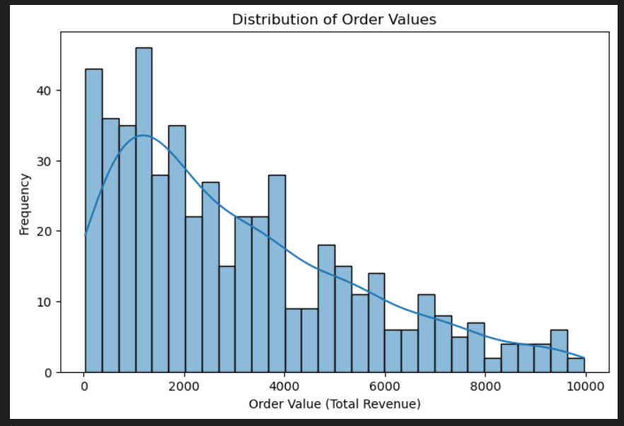

- **Create a bar chart showing total revenue by product category.**
```python
product_revenue = sales.groupby('product_category')['revenue'].sum().reset_index()

plt.figure(figsize=(10, 6))
sns.barplot(x='product_category', y='revenue', data=product_revenue, palette='viridis')
plt.title('Total Revenue by Product Category')
plt.xlabel('Product Category')
plt.ylabel('Total Revenue')
plt.xticks(rotation=45)
plt.show()
```

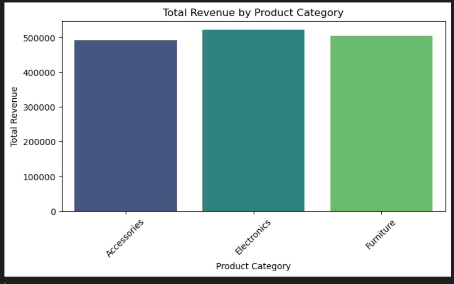

- **Create a time series line plot showing the number of orders placed each month.**
```python
# Ensure 'order_date' is in datetime format
sales['order_date'] = pd.to_datetime(sales['order_date'])

# Extract the month and year for each order as Period (M) and then convert to datetime format
#sales['month_year'] = sales['order_date'].dt.to_period('M').dt.to_timestamp()
sales['month_year'] = sales['order_date'].dt.to_period('M').astype(str)

# Group by month_year and count the number of orders placed each month
orders_per_month = sales.groupby('month_year')['order_id'].count().reset_index()

# Plot the time series line plot
plt.figure(figsize=(10, 6))
sns.lineplot(x='month_year', y='order_id', data=orders_per_month, marker='o')
plt.title('Number of Orders Placed Each Month')
plt.xlabel('Month-Year')
plt.ylabel('Number of Orders')
plt.xticks(rotation=45)
plt.show()
```

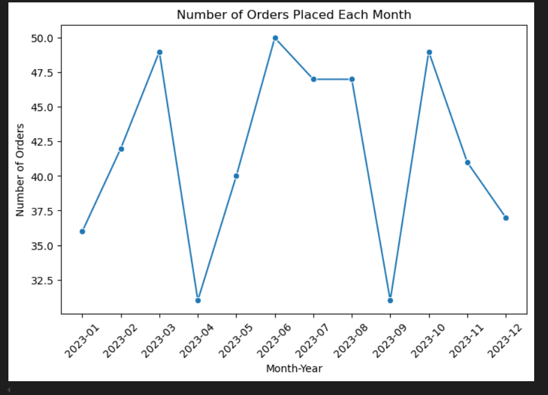


- **Create a horizontal bar plot showing the number of orders placed by country.**

```python
plt.figure(figsize=(10, 6))
sns.barplot(y='country', x='order_id', data=orders_by_country, palette='mako')
plt.title('Number of Orders by Country')
plt.ylabel('Country')
plt.xlabel('Number of Orders')
plt.xticks(rotation=0)
plt.show()
```
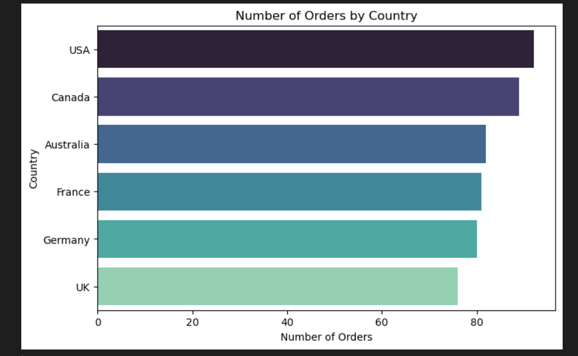


### Key Findings
- **Total Revenue:** The e-commerce platform generated over $1.5M in revenue across 500 transactions.
- **Top Categories:** "Electronics" was the highest revenue-generating product category, followed by "Furniture" and "Accessories."
- **Customer Insights:** Most frequent buyers came from the USA and the UK, with distinct purchasing trends by city and age group.
- **Order Status:** Around 42% of orders were shipped successfully, while others were pending, canceled, or returned.
- **Seasonality:** Sales peaked during key holiday seasons, especially in December.

### Tools Used
**Python:** Data cleaning, wrangling, and analysis using the pandas library.
**pandas:** For DataFrame operations, including filtering, grouping, and merging datasets.
Visualizations: Using **matplotlib** and **seaborn** to create charts.

### Conclusion
This project demonstrates my ability to handle real-world data using Python and pandas, covering the entire data pipeline from initial exploration to advanced analysis and visualization. It showcases critical data analysis skills required for business insights and decision-making.
